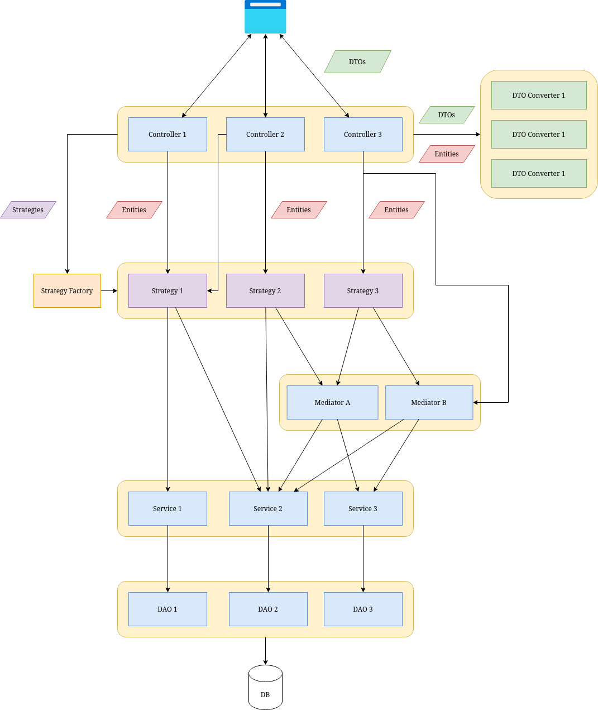

# RDepot Extension Development

## Table of contents

- [RDepot Extension Development](#rdepot-extension-development)
	- [Table of contents](#table-of-contents)
	- [Introduction](#introduction)
	- [Required knowledge base](#required-knowledge-base)
	- [Project setup](#project-setup)
	- [Abstractions to extend](#abstractions-to-extend)
	- [Extending POJOs](#extending-pojos)
		- [Technology](#technology)
		- [Resources](#resources)
		- [Packages and Repositories](#packages-and-repositories)
		- [Packages](#packages)
		- [Repositories](#repositories)
	- [Data Access Layer](#data-access-layer)
		- [JPA Repositories and Services](#jpa-repositories-and-services)
	- [Database](#database)
	- [Storage Layer](#storage-layer)
		- [Implementations](#implementations)
	- [Business logic](#business-logic)
		- [Strategies](#strategies)
		- [Error handling in strategies](#error-handling-in-strategies)
		- [Strategy Factories](#strategy-factories)
		- [Mediators](#mediators)
		- [Delete Mediators](#delete-mediators)
		- [Synchronizer Mediators](#synchronizer-mediators)
	- [Presentation Layer](#presentation-layer)
		- [DTOs](#dtos)
		- [DTOs vs "Simple" DTOs vs "Projections"](#dtos-vs-simple-dtos-vs-projections)
		- [DTO Converters](#dto-converters)
		- [Controller API resources](#controller-api-resources)
			- [Typical API resource structure](#typical-api-resource-structure)
		- [Error handling in the controller](#error-handling-in-the-controller)
		- [Hateoas](#hateoas)
		- [Validation](#validation)
	- [Error Handling and Messaging](#error-handling-and-messaging)

## Introduction

Since version 1.7, RDepot enables developers to create their extensions to support other technologies and programming languages than R. This guide outlines the concepts and abstractions that are to be implemented to create a working extension. It also explains how to properly configure the extension in order to integrate it into the entire RDepot project.

## Required knowledge base

In order to develop an RDepot extension, one first has to be familiar with the following technologies:
* Java 17
* Spring Boot, Spring Security, Spring Data
* Hibernate
* JPA
* Lombok

## Project setup

TODO #32553

## Abstractions to extend



In version 1.7, RDepot's codebase was refactored to better separate abstraction layers and business logic related to different kinds of resources. Therefore, a couple of new abstractions have been introduced which made it easier to avoid circular dependencies and made the relationship between various components more straightforward. Below, you will find the descriptions of all of them with a brief explanation on how they should be implemented in your extension.

After the project setup, the extension development process could be divided into four major steps:

1. Extending POJOs (*Plain Old Java Objects*), which represent the data that might be manipulated
2. Creating default "empty" instances of mandatory data-access and business-logic components
3. Adding custom technology-specific logic and components, optionally overriding certain default behaviors
4. Adding RESTful API resources utilizing the existing API template implementations from the base module

Obviously, only the developer knows what the "technology-specific" logic will contain, but presented below are some examples that may clarify where to implement that logic.

> **Tip:** When implementing a method or adding a property to a class that extends or implements another class or interface in the base module, please first check and make sure that it is not already there and could be reused.

## Extending POJOs

### Technology

Let's start with the most basic POJO that describes the extension. It will be used to identify which technology a specific resource belongs to in the base module.

For every technology version, there is a separate singleton object. For example:

```java
package eu.openanalytics.rdepot.r.technology;

public class RLanguage implements Technology {
	
	public static RLanguage instance;
	
	static {
		instance = new RLanguage();
	}

	@Override
	public Technology getInstance() {
		return instance;
	}

	@Override
	public String getName() {
		return "R";
	}

	@Override
	public String getVersion() {
		return "1.0.0";
	}

	@Override
	public Boolean isCompatible(String version) {
		// Determines if this technology is compatible with its version provided in the argument
		return Objects.equals(version, this.getVersion());
	}

	@Override
	public int hashCode() {
		return Objects.hash(getName(), getVersion());
	}
	
	@Override
	public boolean equals(Object obj) {
		if(obj == null) return false;
		if(!obj.getClass().isAssignableFrom(RLanguage.class)) return false;
		RLanguage that = (RLanguage) obj;
		return this.getName().equals(that.getName()) 
				&& this.getVersion().equals(that.getVersion());
	}
}
```

### Resources

Every resource managed by RDepot extends the `Resource` class. It provides a couple of common properties:

- `technology` - identifies the extension that manages the resource; for resources that are technology-agnostic, the `InternalTechnology` class is used
- `resourceType` - enum allowing to identify the resource type without casting or reflection; can be one of the following:
  - PACKAGE
  - REPOSITORY
  - SUBMISSION
  - REPOSITORY_MAINTAINER
  - PACKAGE_MAINTAINER
  - USER
  - EVENT
  - ROLE
  - USER_SETTINGS
  - ACCESS_TOKEN
- `deleted` - used to indicate that although a resource is not physically removed from persistent storage, from the user's perspective it should be treated as such (i.e. *soft-deleted*)
- `id` - integer specifiying the unique identifier of a resource; **Please note** that the id has to be unique *only* across one resource type, e.g. there can be a repository and a package with the same IDs but not two packages (nor RPackage and PythonPackage with the same ID since they have the same `resourceType` and share a table in the database)

The `Resource` class however is rarely extended directly. Most resources extend the `EventableResource` class, therefore also implementing the `HavingSimpleDtoRepresentation` interface. This is used, as the name suggest for the construction of Newsfeed Events. When a user requests an event related to a certain resource, they probably also want to get a simple representation of that resource attached. In such cases, the `createSimpleDto()` method of the aforementioned interface is executed. You will later be presented with example implementations of these.

### Packages and Repositories

Start with extending the two main resource classes, both of which extend `EventableResource` -  `Package` and `Repository`.

No need to add custom properties to any of these classes, but extending them is mandatory to make the extension work.

### Packages

The most relevant data structure in the system is `Package`. There are some common properties that are defined in the base class such as `author` or `title`. In the extended implementation, one can put properties that are technology-specific. Take a look at the `RPackage` class to see what is going on there:

```java
package eu.openanalytics.rdepot.r.entities;

@Entity
@Getter
@Setter
@DiscriminatorValue("R")
@EqualsAndHashCode(callSuper = true)
@SecondaryTable(name = "rpackage", pkJoinColumns = @PrimaryKeyJoinColumn(name = "id"))
public class RPackage extends Package {

	@Column(name = "depends", table = "rpackage")
	private String depends = "";
	
	@Column(name = "imports", table = "rpackage")
	private String imports = "";
	
	@Column(name = "suggests", table = "rpackage")
	private String suggests = "";
	
	@Column(name = "system_requirements", table = "rpackage")
	private String systemRequirements = "";
	
	@Column(name = "license", nullable = false, table = "rpackage")
	private String license;
	
	@Column(name = "md5sum", nullable = false, table = "rpackage")
	private String md5sum;
	
	@ManyToOne(fetch = FetchType.EAGER)
	@JoinColumn(name = "repository_id", nullable = false)
	private RRepository repository;
	
	@Transient
	private Boolean generateManuals;

	@Transient
	public Boolean getGenerateManuals() {
		return generateManuals;
	}

	@Transient
	public void setGenerateManuals(Boolean generateManuals) {
		this.generateManuals = generateManuals;
	}

	public void setRepository(RRepository repository) {
		this.repository = repository;
		super.setRepositoryGeneric(repository);
	}
	
	//...
	// A couple of different constructors skipped in this listing for better readability
}
```

There are a couple of properties which can be found in an R package but not, for example, in a Python package such as `md5sum`. The properties that are persisted in the database are annotated with proper Hibernate annotations. Those that are dynamically assigned are annotated with `@Transient`.

The important part is combining the technology-specific repository setter with `setRepositoryGeneric(Repository)`. This is a work-around to allow JPA to find packages by repository across technologies.


### Repositories

Repositories are used to group packages in order to eventually publish (some of) them on a remote repository server. In principle, one repository represents one publication server, therefore also a single technology. In the case of R, no extra properties are added.

```java
package eu.openanalytics.rdepot.r.entities;

@Entity
@DiscriminatorValue("R")
@SecondaryTable(name = "rrepository", pkJoinColumns = @PrimaryKeyJoinColumn(name = "id"))
public class RRepository extends Repository implements Serializable {

	@Serial
	private static final long serialVersionUID = 3346101145064616895L;
	
	public RRepository() {
		super(RLanguage.instance);
	}
	
	public RRepository(RRepositoryDto dto) {
		super(RLanguage.instance, dto);
	}
	
	public RRepository(RRepository that) {
		super(that);
	}

	@Override
	public RRepositorySimpleDto createSimpleDto() {
		return new RRepositorySimpleDto(this);
	}
}
```

## Data Access Layer

After the data structures are defined, the persistence layer can be implemented. This corresponds with the two layers at the bottom, on the [diagram above](#abstractions-to-extend). 

### JPA Repositories and Services

Firstly, let's extend JPA Repositories for our newly created entities:

```java
package eu.openanalytics.rdepot.r.daos;

public interface RRepositoryDao extends RepositoryDao<RRepository> {}
```

```java
package eu.openanalytics.rdepot.r.daos;

public interface RPackageDao extends PackageDao<RPackage> {}
```

Unless extra filtering, sorting or custom SQL queries are needed, there is no need to do anything there. Similarly for Services:

```java
package eu.openanalytics.rdepot.r.services;

@Service
public class RRepositoryService extends RepositoryService<RRepository>{
	public RRepositoryService(RRepositoryDao dao) {
		super(dao);
	}
}
```

```java
package eu.openanalytics.rdepot.r.services;

@Service
public class RPackageService extends PackageService<RPackage> {
	public RPackageService(RPackageDao dao) {
		super(dao);
	}
}
```

Services may seem redundant in the context of JPA Repositories but they really are not. First of all, having a separate Service layer allows one to move away from JPA in the future. Additionally, implementing logic which combines different JPA methods or performs more advanced database actions is necessary in some cases. Then, Services will come in handy. Please note however, that if there is a need to create business logic which would deal with various kinds of resources, mediators or strategies will be a better fit (more on these later).

## Database

The database will also require additional implementation. 

First of all, a new `technology repository table` has to be added. This table reflects the new Repository resource. Usually it will just contain an `id` column. Extra columns related to a particular technology can be added as well.

Secondly, a new `technology package table` has to be introduced. This table will store all properties that are required by the Packages of the new technology.

The best way to extend the database is by adding Liquibase scripts in `rdepot-app/src/main/resources/db/changelog/schema/`. 

An example script for Python can be found below:
```yaml
databaseChangeLog:
  - changeSet:
      id: 04_02_pythonrepository_table
      author: kkulesa
      preConditions:
        - onFail: MARK_RAN
        - not:
            - tableExists:
                tableName: pythonrepository
                schemaName: public
      changes:
        - createTable:
            schemaName: public
            tableName: pythonrepository
            columns:
              - column:
                  name: id
                  type: integer
                  constraints:
                    primaryKey: true
              - column:
                  name: hash_method
                  type: text
                  defaultValue: SHA256
                  constraints:
                    nullable: true
  - changeSet:
      id: 04_03_pythonpackage
      author: kkulesa
      preConditions:
        - onFail: MARK_RAN
        - not:
            - tableExists:
                tableName: pythonpackage
                schemaName: public
        - createTable:
            schemaName: public
            tableName: pythonpackage
            columns:
              - column:
                  name: id
                  type: integer
                  constraints:
                    primaryKey: true
              - column:
                  name: license
                  type: text
                  constraints:
                    nullable: false
              - column:
                  name: author_email
                  type: text
                  constraints:
                    nullable: true
              - column:
                  name: classifier
                  type: text
                  constraints:
                    nullable: true
              - column:
                  name: description_content_type
                  type: text
                  constraints:
                    nullable: true              
```

For brevity, some of the columns in the `pythonpackage` table were omitted. 

> Please note that there are no sequences to generate IDs. IDs are shared with the technology-agnostic `package` and `repository` tables.

## Storage Layer

Alongside the Persistence Layer, there are Storage components for package binary files that will be served to the users.

The Storage in general should provide the following locations:

- *waiting room* - packages that are uploaded, of which their submissions are not yet accepted, end up there. It exists in order to make submission rejection and therefore permanent removal from the persistent storage easier (as we do not need to modify the contents of currently existing repository snapshots)
- *trash directory* - when a package is permanently deleted, it may happen that something goes wrong in the middle of the process. In such a case, and in order not to leave the storage in an inconsistent state, there is a trash directory where packages which were attempted to be deleted may be recovered from
- *main directory* - when the package is uploaded and its submission has been successfully accepted, the package source is moved to the main directory which represents the current state of the repository
- *generated* - contains the state of a repository that will be uploaded to the remote repository server

Methods responsible for putting content in those locations are provided by the `Storage` and `RepositorySynchronizer` interfaces.

### Implementations

The Storage components can be characterized by two elements:

- Back-end technology used for storage (e.g. AWS S3, local file system)
- Technology which the storage supports (e.g. Python, R)
  
The main interface that exposes the basic Storage features is `Storage` in the base module. There is also an abstract back-end implementation `CommonLocalStorage` which can be used as a backbone for extension storage, if storing packages on the file system is needed. There are plans to implement AWS S3 support (and possibly other cloud storage services) in the future. It is therefore important not to couple the logic in the extension code with any specific back-end in order to allow users' choice in the future. In order to achieve that, please stick to these best practices:

- Always inject Storage as an interface, not a specific implementation
- If some additional functionality is needed, simply create a separate Storage class which implements the Storage interface

For example, there were certain R specific features that had to be handled in Storage:

```java
package eu.openanalytics.rdepot.r.storage;

public interface RStorage extends Storage<RRepository, RPackage> {
	/**
	 * Fetches reference manual file from the storage.
	 * @param packageBag
	 * @return
	 */
	byte[] getReferenceManual(RPackage packageBag) throws GetReferenceManualException;
	
	/**
	 * Fetches links to available vignettes for a given package.
	 * @param packageBag
	 * @return
	 */
	List<Vignette> getAvailableVignettes(RPackage packageBag);

	/**
	 * Reads vignette from storage.
	 * @param packageBag
	 * @param filename
	 * @return
	 */
	byte[] readVignette(RPackage packageBag, String filename) throws ReadPackageVignetteException;
	
	/**
	 * Creates manual for a package and puts it in the local storage.
	 * @param packageBag
	 * @throws GenerateManualException
	 */
	void generateManual(RPackage packageBag) throws GenerateManualException;

	// Other methods...
}
```

The implementation thereof is defined as below:

```java
package eu.openanalytics.rdepot.r.storage.implementations;

/**
 * Local storage implementation for R.
 */
@Slf4j
@Component
public class RLocalStorage 
	extends CommonLocalStorage<RRepository, RPackage> // we want to use the file system 
	implements RStorage { // we want to support R
	
	@Resource(name = "packageUploadDirectory")
	private File packageUploadDirectory;
	
	@Resource(name="repositoryGenerationDirectory")
	private File repositoryGenerationDirectory;
	
	@Value("${repository-snapshots}")
	private String snapshot;

	@Override
	public Properties getPropertiesFromExtractedFile(final String extractedFile) 
			throws ReadPackageDescriptionException {
		try {
			return new PropertiesParser(new File(extractedFile + separator + "DESCRIPTION"));
		} catch (IOException e) {
			try {
				deleteFile(new File(extractedFile).getParentFile());
			} catch (DeleteFileException dfe) {
				log.error(dfe.getMessage(), dfe);
			}
			log.error(e.getMessage(), e);
			throw new ReadPackageDescriptionException();
		}
	}

	@Override
	public byte[] getReferenceManual(RPackage packageBag) throws GetReferenceManualException {
		final String manualPath = new File(packageBag.getSource()).getParent() 
				+ separator + packageBag.getName() 
				+ separator + packageBag.getName() + ".pdf";
		final File manualFile = new File(manualPath);
		
		try {
			return readFile(manualFile);
		} catch(IOException e) {
			log.error(e.getMessage(), e);
			throw new GetReferenceManualException(e);
		}
	}

	@Override
	public byte[] readVignette(RPackage packageBag, String filename) throws ReadPackageVignetteException {
		final String vignetteFilename = new File(packageBag.getSource()).getParent() 
				+ separator + packageBag.getName() 
				+ separator + "inst" + separator + "doc" 
				+ separator + filename;
		final File file = new File(vignetteFilename);
		
		try {
			return readFile(file);
		} catch (IOException e) {
			log.error(e.getMessage(), e);
			throw new ReadPackageVignetteException(e);
		}
	}

	// Other methods...
}
```

Implementation of the "basic" storage part of `RStorage` is already covered by `CommonLocalStorage` so there is no need to override those methods.

## Business logic

Business logic is handled by a mixture of Strategy and Mediator design patterns. This approach was introduced in version 1.7 in order to allow more flexibility and reduce dependency coupling.

### Strategies

A Strategy represents a single operation. It is an object which is equipped with all necessary dependencies from the layers below it, the data to process and the user object of the requester. This Strategy object is constructed every time any operation like uploading a package or updating a repository is performed. Its structure can be divided into four basic steps with corresponding methods (that can simply be overridden):

1. `actualStrategy()` - Perform the *actual* business logic, for instance:
   - process data
   - call different service methods
   - write into storage
2. `generateEvent(T resource)` - Generate a Newsfeed Event object representing the operation and publish it
3. `postStrategy()` - Perform some post-operation routines that, if they fail, do not fail the entire strategy
4. Return the resource processed by business logic

There is also the `revertChanges()` method which will be used in later RDepot versions for moving the state of repositories back to a given point in time.

There are currently three kinds of strategies:

- Create Strategy - creates resources
- Upload Strategy - handles package upload
- Update Strategy - updates resources ("updates" also include "soft-deletes")

There is no Strategy for (hard-)deleting resources. More on that [later](#delete-mediators).

As an example, let's take `RRepositoryCreateStrategy`, which as the name suggests, creates an R Repository. It extends an abstract `CreateRepositoryStrategy` and since there is nothing specific about the way repositories for R are created, the only thing that needs to be done is to extend it:

```java
package eu.openanalytics.rdepot.r.strategy.create;

public class RRepositoryCreateStrategy extends CreateRepositoryStrategy<RRepository> {

	public RRepositoryCreateStrategy(
			RRepository resource, 
			NewsfeedEventService newsfeedEventService, 
			RRepositoryService service,
			User requester) {
		super(resource, service, requester, newsfeedEventService);
	}

}
```

It is a little bit different when it comes to package uploads:

```java
public class RPackageUploadStrategy 
	extends DefaultPackageUploadStrategy<RRepository, RPackage> {

	private final RStorage rStorage;
	
	public RPackageUploadStrategy(
			PackageUploadRequest<RRepository> request, 
			User requester, 
			NewsfeedEventService eventService,
			SubmissionService service, 
			PackageValidator<RPackage> packageValidator, 
			RepositoryService<RRepository> repositoryService,
			Storage<RRepository, RPackage> storage, 
			PackageService<RPackage> packageService, 
			EmailService emailService, 
			BestMaintainerChooser bestMaintainerChooser,
			RRepositorySynchronizer repositorySynchronizer,
			SecurityMediator securityMediator,
			RStorage rStorage, 
			RPackageDeleter packageDeleter) {
		super(request, 
				requester, 
				eventService, 
				packageValidator, 
				repositoryService, 
				storage,
				packageService, 
				service, 
				emailService, 
				bestMaintainerChooser,
				repositorySynchronizer,
				securityMediator,
				packageDeleter);
		this.rStorage = rStorage;
	}

	@Override
	protected RPackage parseTechnologySpecificPackageProperties(Properties properties) throws ParsePackagePropertiesException {
		RPackage packageBag = new RPackage();
		
		packageBag.setDescription(properties.getProperty("Description"));
		packageBag.setDepends(properties.getProperty("Depends"));
		packageBag.setImports(properties.getProperty("Imports"));
		packageBag.setSuggests(properties.getProperty("Suggests"));
		packageBag.setSystemRequirements(properties.getProperty("System Requirements"));
		packageBag.setLicense(properties.getProperty("License"));
		packageBag.setUrl(properties.getProperty("URL"));
		packageBag.setTitle(properties.getProperty("Title"));
		
		return packageBag;
	}

	@Override
	protected Submission actualStrategy() throws StrategyFailure {
		Submission submission = super.actualStrategy();
		try {
			if(request.isGenerateManual())
				rStorage.generateManual(packageBag);
		} catch (GenerateManualException e) {
			logger.error(e.getMessage(), e);
			throw new StrategyFailure(e);
		}
		return submission;
	}

	@Override
	protected void assignRepositoryToPackage(RRepository repository, RPackage packageBag) {
		packageBag.setRepository(repository);
	}

}
```

First, additional properties need to be parsed from the `Properties` object. This type of object is returned by Storage, using its `getPropertiesFromExtractedFile(String)` method. Secondly, the `actualStrategy` method, which is the main strategy method, has to be overridden to include R-specific manual generation as the last part of the process. Additionally, a method `assignRepositoryToPackage` has to be implemented to link the two respective objects together. Here it simply means using a `setRepository(RRepository)` method on `RPackage`.

>**Note:** It may seem that instead of having to implement the `assignRepositoryToPackage` method, one could simply use the `setRepository` method with generic parameters in the parent class. This would mean, however, that `Package` would have to be parameterized with `<T extends Repository>`.
> Although it may not seem so bad, it slightly reduces code readability since the parameterization populates to other objects which are also parameterized themselves in the base module. Thus, it has been decided to force the extension module to implement that behavior on its own.

### Error handling in strategies

If something goes wrong, the strategy throws an exception. There are two kinds of exceptions:

1. More generic `StrategyFailure` - when there was an error which was not critical, so the strategy can still be considered as partially performed
2. `FatalStrategyFailure` - when there was a critical error

The original exception can be retrieved with the `getReason()` method.

### Strategy Factories

Strategies are dynamically created objects and they have to be supplied with required dependencies and data. Injecting dependencies may lead to a situation when a higher-layer component (e.g. a Controller) starts depending on many other components just so it can construct the strategies. In order not to pollute the controllers, `StrategyFactory` classes were created. Their only job is to depend on other components to feed them to strategy constructors and return strategy objects.

```java
package eu.openanalytics.rdepot.r.strategy.factory;

@Component
@AllArgsConstructor
public class RStrategyFactory {
	
	// Autowired dependencies
	private final SubmissionService submissionService;
	private final PackageValidator<RPackage> packageValidator;	
	private final RRepositoryService repositoryService;
	private final Storage<RRepository, RPackage> storage;
	private final RPackageService packageService;
	private final EmailService emailService;
	private final BestMaintainerChooser bestMaintainerChooser;
	private final NewsfeedEventService newsfeedEventService;
	private final RRepositorySynchronizer repositorySynchronizer;
	private final SecurityMediator securityMediator;
	private final PackageMaintainerService packageMaintainerService;
	private final RepositoryMaintainerService repositoryMaintainerService;
	private final RStorage rStorage;
    private final RPackageDeleter rPackageDeleter;
	
	public Strategy<RPackage> updatePackageStrategy(RPackage resource, User requester, RPackage updatedPackage) {
		return new RPackageUpdateStrategy(
				resource,
				newsfeedEventService,
				packageService,
				requester,
				updatedPackage,
				storage,
				bestMaintainerChooser,
				repositorySynchronizer);
	}
	
	public Strategy<RRepository> createRepositoryStrategy(RRepository resource, User requester) {
		return new RRepositoryCreateStrategy(
					resource, 
					newsfeedEventService, 
					repositoryService, 
					requester
				);
	}

	// Other strategy factory methods...
}
```

In higher layers, these methods can now be used:

```java
Strategy<RRepository> strategy = factory.updateRepositoryStrategy(repository, requester, updated);
repository = strategy.perform();
```

### Mediators

Although strategies allow to decouple dependencies by separating business logic from the data access layer, they can easily grow as the logic becomes more complicated. In order to avoid god-like objects, certain sub-processes have been moved to so-called "mediators". They allow to handle resources of various types, by grouping multiple services, making them similar to strategies. What sets them apart though, is that they are *Beans*, and not dynamically created objects. They have no specific structure, thus they do not have to result in Newsfeed Event creation. An example of a Mediator is the `BestMaintainerChooser` class from the base module:

```java
package eu.openanalytics.rdepot.base.mediator;

@Slf4j
@Component
@Transactional
@AllArgsConstructor
public class BestMaintainerChooser {
	
	private final RepositoryMaintainerService repositoryMaintainerService;
	private final PackageMaintainerService packageMaintainerService;
	private final UserService userService;
	private final RoleService roleService;	
	
	/**
	 * Finds the best package maintainer for a given package.
	 * @param packageBag
	 * @return
	 */	
	public User chooseBestPackageMaintainer(Package packageBag) throws NoSuitableMaintainerFound {
		final Optional<PackageMaintainer> packageMaintainer = 
				packageMaintainerService.findByPackageAndRepositoryAndNonDeleted(
						packageBag.getName(), packageBag.getRepository());
		
		if(packageMaintainer.isPresent()) {
			return packageMaintainer.get().getUser();
		}
		
		final List<RepositoryMaintainer> repositoryMaintainers = 
				repositoryMaintainerService.findByRepositoryNonDeleted(packageBag.getRepository());
		if(!repositoryMaintainers.isEmpty()) {
			return repositoryMaintainers.get(0).getUser();
		} else {
			try {
				return findFirstAdmin();
			} catch (AdminNotFound e) {
				log.error(e.getMessage(), e);
			}
		}
		throw new NoSuitableMaintainerFound();
	}
	
	/**
	 * Updates all packages in the list with the most suitable maintainer.
	 * @param packages
	 * @throws NoSuitableMaintainerFound
	 */
	public void refreshMaintainerForPackages(List<Package> packages) throws NoSuitableMaintainerFound {
		for(Package packageBag : packages) {
			packageBag.setUser(chooseBestPackageMaintainer(packageBag));
		}	
	}
	
	/**
	 * Finds any administrator in the system.
	 * @return
	 * @throws AdminNotFound
	 */
	public User findFirstAdmin() throws AdminNotFound {
		final List<User> admins = findAllAdmins();
		
		if(admins.isEmpty())
			throw new AdminNotFound();
		
		return admins.get(0);
	}
	
	/**
	 * Finds all administrators in the systems.
	 * @return
	 */
	public List<User> findAllAdmins() {
		final Optional<Role> adminRole = roleService.findByValue(Role.VALUE.ADMIN);
		if(adminRole.isEmpty())
			return List.of();
		
		return userService.findByRole(adminRole.get());
	}
}
```

### Delete Mediators

RDepot supports two types of deletion:

- *soft-delete* - this means the `deleted` flag of a resource is set to *true*, it becomes invisible to any users (except admins) and the related events remain in the database;
- *hard-delete* - this means a HTTP `DELETE` request is performed on a designated API resource; only admins can do this, since it remove the resource(s) from the database (including all related events) and storage

Delete Mediators are meant to deal with *hard-deletes*. In the case of R, they only have to be extended and instantiated (i.e. marked as `@Component`) as they delegate work to Storage and Services. Naturally, if an extension needs it, these behaviors can be extended.

```java
package eu.openanalytics.rdepot.r.mediator.deletion;

@Component
public class RSubmissionDeleter extends SubmissionDeleter {
	public RSubmissionDeleter(NewsfeedEventService newsfeedEventService,
			Service<Submission> resourceService,
			RPackageDeleter packageDeleter) {
		super(newsfeedEventService, resourceService, packageDeleter);
	}
}
```

### Synchronizer Mediators

There are two kinds of synchronization that take place in RDepot: publication and mirroring. Publication is handled by the `RepositorySynchronizer` single-method interface:

```java
public interface RepositorySynchronizer<T extends Repository> {
	/**
	 * Stores repository on a public server.
	 * @param repository to publish
	 * @param dateStamp in the format "yyyyMMdd"
	 * @throws SynchronizeRepositoryException
	 */
	void storeRepositoryOnRemoteServer(T repository, String dateStamp) 
			throws SynchronizeRepositoryException;
}
```

What the publication flow looks like depends entirely on the specific technology. The bottom line is that the packages from a given repository have to end up on a remote repository server, available to be downloaded by users using their package managers.

Mirroring however, means that *configured* repositories need to be in sync with other publicly available repositories. However, in 2.0 it is only available for the R extension as it integrates with the RDepot configuration. Future releases will enable developers to implement it for other technologies.

## Presentation Layer

Communication with RDepot takes place over its RESTful API. The API supports HATEOAS and Pagination. The chapters below describe how it can be implemented for other extensions.

### DTOs

Before implementing API resources, the data structures need to be defined that will be used in the RESTful communication with clients. They are called *Data Transfer Objects* or simply *DTOs*. In principle, they should be simple enough to be easily converted into and from JSON. They also contain a reference to their respective entity.

```java
public interface IDto {
	@JsonIgnore
	public Resource getEntity();
}
```

*Example DTO - RepositorySimpleDto*

```java
package eu.openanalytics.rdepot.base.api.v2.dtos;

@Data
@AllArgsConstructor
@NoArgsConstructor
public class RepositorySimpleDto implements IDto {

	private Integer id = 0;
	private Integer version = 0;
	private String publicationUri;
	private String name;
	private String serverAddress = "127.0.0.1";
	private Boolean deleted = false;
	private Boolean published = false;
	private Boolean synchronizing = false;
	private String technology;
	@ToStringExclude 
	private Repository entity;

	public RepositorySimpleDto(Repository repository) {
		this.id = repository.getId();
		this.version = repository.getVersion();
		this.publicationUri = repository.getPublicationUri();
		this.name = repository.getName();
		this.serverAddress = repository.getServerAddress();
		this.deleted = repository.isDeleted();
		this.published = repository.getPublished();
		this.synchronizing = repository.isSynchronizing();
		this.technology = repository.getTechnology().getName();
		this.entity = repository;
	}

	public Boolean isDeleted() {
		return deleted;
	}
	
	public Boolean isPublished() {
		return published;
	}
	
	public Boolean isSynchronizing() {
		return synchronizing;
	}

	@Override
	@JsonIgnore
	public Resource getEntity() {
		return this.entity;
	}
}
```


*R Example - RRepositoryDto*

```java
package eu.openanalytics.rdepot.r.api.v2.dtos;

@NoArgsConstructor
public class RRepositoryDto extends RepositoryDto {
	@ToStringExclude 
	private RRepository entity;

	public RRepositoryDto(RRepository repository, int numberOfPackages) {
		super(repository, numberOfPackages);
		this.entity = repository;
	}
	
	@Override
	public Resource getEntity() {
		return entity;
	}
}
```

The POJOs will be automatically converted into JSON when the response is built. For example, the response to `GET /api/v2/manager/r/repositories/5` will look like this:

```json
{
  "code": 200,
  "data": {
    "deleted": false,
    "synchronizing": false,
    "name": "testrepo4",
    "serverAddress": "http://oa-rdepot-repo:8080/testrepo4",
    "links": [
      {
        "rel": "self",
        "href": "http://localhost:8017/api/v2/manager/r/repositories/5"
      },
      {
        "rel": "repositoryList",
        "href": "http://localhost:8017/api/v2/manager/r/repositories"
      },
      {
        "rel": "self",
        "href": "http://localhost:8017/api/v2/manager/r/repositories/5",
        "type": "PATCH"
      },
      {
        "rel": "self",
        "href": "http://localhost:8017/api/v2/manager/r/repositories/5",
        "type": "DELETE"
      }
    ],
    "id": 5,
    "published": true,
    "technology": "R",
    "version": 7,
    "publicationUri": "http://localhost/repo/testrepo4",
    "numberOfPackages": 4
  },
  "messageCode": "success.request.processed",
  "message": "Your request has been processed successfully.",
  "status": "SUCCESS"
}
```

### Full DTOs vs "Simplified" DTOs vs "Projections"

For both Packages and Repositories, there are three classes defined: "Simplified DTOs", full "DTOs" that extend them and "projections". Simplified DTOs are used when a resource is attached to another, for example a Newsfeed Event. In such a case, not all information about e.g. a Repository (which an Event is related to) is needed, therefore we can use the simplified version of the DTO. If a regular `GET` request was made on resources, then the full DTOs are used.

Projections however, are used in situations where there is a bilateral relationship between objects and nesting one object in another object would lead to a circular relation. For example: every Submission is related to a Package and vice versa. In this case, when attaching a Submission to a Package DTO object, the "Package" part from the Submission should be ignored as it is already represented by the parent. Then the shorter "Projection" object is used.

*Regular Submission DTO*

```java
@Data
@NoArgsConstructor
@AllArgsConstructor
@JsonIgnoreProperties(ignoreUnknown = true)
public abstract class AbstractSubmissionDto<T extends IDto> implements IDto {

	protected Integer id;
	protected EntityModel<T> packageBag;

	@JsonIgnore
	protected T packageBagDto;
	protected UserProjection submitter;
	protected UserProjection approver;
	protected String changes;
	protected SubmissionState state;
	@ToStringExclude 
	protected Submission entity;
	protected String technology;
	
	public AbstractSubmissionDto(Submission submission, T packageDto) {
		this.entity = submission;
		this.id = submission.getId();
		this.packageBagDto = packageDto;
		this.packageBag = EntityModel.of(packageDto);
		this.changes = submission.getChanges();
		this.state = submission.getState();
		this.technology = submission.getTechnology().getName();
		if(Objects.nonNull(submission.getSubmitter())) {
			this.submitter = new UserProjection(submission.getSubmitter());
		} else {
			this.submitter = null;
		}
		if(Objects.nonNull(submission.getApprover())) {
			this.approver = new UserProjection(submission.getApprover());
		} else {
			this.approver = null;
		}
	}
	
	@Override
	@JsonIgnore
	public Submission getEntity() {
		return entity;
	}
}
```

*Submission Projection*

```java
@Getter
@NoArgsConstructor
public class SubmissionProjection {

	private Integer id;
	private SubmissionState state;

	public SubmissionProjection(Submission submission) {
		this.id = submission.getId();
		this.state = submission.getState();
	}
}
```

### DTO Converters

DTOs are simple POJOs that are used for converting into JSON, while entities reflect some database state and relationships between objects. In order to use both properly, it is needed to convert them both ways: resolve DTOs to entities when input data are ingested and convert entities to DTOs when results are returned. It is done by the `DtoConverter` beans. This is an example of such a converter for R Packages:

```java
package eu.openanalytics.rdepot.r.api.v2.converters;

@Component
@AllArgsConstructor
public class RPackageDtoConverter implements DtoConverter<RPackage, RPackageDto> {

	private final RRepositoryService repositoryService;
	private final UserService userService;
	private final SubmissionService submissionService;

	@Override
	public RPackage resolveDtoToEntity(RPackageDto dto) throws EntityResolutionException {
		RRepository repository = repositoryService.findById(dto.getRepository().getId())
				.orElseThrow(() -> new EntityResolutionException(dto));
		User user = userService.findById(dto.getUser().getId())
				.orElseThrow(() -> new EntityResolutionException(dto));
		Submission submission = submissionService.findById(dto.getSubmission().getId())
				.orElseThrow(() -> new EntityResolutionException(dto));
		return new RPackage(dto, repository, submission, user);
	}

	@Override
	public RPackageDto convertEntityToDto(RPackage entity) {
		return new RPackageDto(entity);
	}

}
```

Some of this conversion simply takes places in the constructors, as it does not require any interaction with beans or does not have any complex business logic.

### Controller API resources

Most of the API controllers should extend the `ApiV2Controller` or `ApiV2ReadingController` classes (the latter when it will just be used for HTTP `GET` requests). It is parametrized with the entity type that it handles and the DTO type that it uses to communicate with clients. It exposes a couple of `protected` methods to generate unified responses across different extensions and perform certain routine operations that are common for many controller methods.

* `handleSuccessForSingleEntity(Entity data)` - generates a `200 OK` response out of a single entity object (useful for `GET` methods)
* `handleCreatedForSingleEntity(Entity data)` - generates a `201 Created` response out of a newly created entity object (useful for `POST` methods)
* `handleSuccessForPagedCollection(Page<Entity> items)` - generates a `200 OK` response out of a page of entity objects
* `handleWarningForSingleEntity(E data, String messageCode, User user)` - generates a `200 OK` response with a warning message (e.g. for a duplicate package)
* `handleValidationError(String messageCode)` - generates a `422 Unprocessable Entity` response when validation fails
* `handleValidationError(BindingResult bindingResult)` - generates a validation error out of a `BindingResult` object
* `handleValidationError(Exception e)` - generates a validation error out of an `exception`
* `applyPatchToEntity(JsonPatch patch, E entity)` - this method is used for `PATCH` requests to apply a `JsonPatch` object to the entity and return a patched `Dto` object

#### Typical API resource structure

In principle, the controller should have a fixed structure and no business logic inside. Summarized steps for `POST`, `PUT` and `PATCH` API resources:

1. Authorize
2. Validate input data
3. Execute business logic
4. Generate response

For `GET` controllers it is slightly different:
1. Authorize
2. Digest request parameters
3. Execute business logic to fetch data
4. Generate response

`RRepositoryController` may serve as an example of a typical RESTful RDepot API resource. It makes use of a `Specification` object to handle multiple combinations of request parameters and returns a filtered set of data based on these.

```java
	@PreAuthorize("hasAuthority('user')")
	@GetMapping
	@ResponseStatus(HttpStatus.OK)
	@PageableAsQueryParam
	@Operation(operationId = "getAllRRepositories")
	public @ResponseBody ResponseDto<PagedModel<EntityModel<RRepositoryDto>>> getAllRepositories(
			Principal principal,
			@ParameterObject Pageable pageable,
			@RequestParam(name = "deleted", required = false, defaultValue = "false") Boolean deleted,
			@RequestParam(name = "name", required = false) Optional<String> name
	) throws ApiException {
		// 1. Authorize
		User requester = userService.findByLogin(principal.getName())
				.orElseThrow(() -> new UserNotAuthorized(messageSource, locale));
		if((!userService.isAdmin(requester) && deleted))
			throw new UserNotAuthorized(messageSource, locale);

		// 2. Digest request parameters
		pageableValidator.validate(pageable);
		Specification<RRepository> specs = null;
				 		
		specs = SpecificationUtils.andComponent(specs, RepositorySpecs.isDeleted(deleted));
		if(name.isPresent())
			specs = SpecificationUtils.andComponent(specs, RepositorySpecs.ofName(name.get()));

		// 3. Execute business logic to fetch data & 4. Generate response
		return handleSuccessForPagedCollection(repositoryService
			.findAllBySpecification(specs, pageable), 
			requester);
	}
```

Creating a new repository may look as follows:

```java
	@PreAuthorize("hasAuthority('admin')")
	@PostMapping
	@ResponseStatus(HttpStatus.CREATED)
	@Operation(
			operationId = "createRRepository"
	)
	public @ResponseBody ResponseEntity<?> createRepository(
			Principal principal, @RequestBody RRepositoryDto repositoryDto) 
					throws NotAllowedInDeclarativeMode, UserNotAuthorized, CreateException {
		// 1. Authorize
		User requester = userService.findByLogin(principal.getName())
				.orElseThrow(() -> new UserNotAuthorized(messageSource, locale));
		if(!userService.isAdmin(requester))
			throw new UserNotAuthorized(messageSource, locale);
		
		if(Boolean.parseBoolean(declarative))
			throw new NotAllowedInDeclarativeMode(messageSource, locale);
		
		try {
			// 2. Validate
			RRepository repositoryEntity = dtoConverter.resolveDtoToEntity(repositoryDto);
			BindingResult bindingResult = createBindingResult(repositoryEntity);
			
			repositoryValidator.validate(repositoryEntity, bindingResult);
			
			if(bindingResult.hasErrors())
				return handleValidationError(bindingResult);
			
			// 3. Execute business logic
			Strategy<RRepository> strategy = factory.createRepositoryStrategy(repositoryEntity, requester);
			
			RRepository repository = strategy.perform();

			// 4. Generate response
			return handleCreatedForSingleEntity(repository, requester);
		} catch (StrategyFailure e) {
			log.error(e.getClass().getName() + ": " + e.getMessage(), e);
			throw new CreateException(messageSource, locale);
		} catch (EntityResolutionException e) {
			return handleValidationError(e);
		}			
	}
```

### Error handling in the controller

Errors can be handled either by calling a dedicated method manually like `handleValidationError` or just by throwing an `ApiException` which is automatically intercepted by the `ApiV2ErrorController` that will take care of the response. Both are used in the listing below:

```java
//...
		catch (StrategyFailure e) {
			log.error(e.getClass().getName() + ": " + e.getMessage(), e);
			throw new CreateException(messageSource, locale); // API Exception intercepted by ApiV2ErrorController
		} catch (EntityResolutionException e) {
			return handleValidationError(e); // handler method from parent class
		}	
//
```

### HATEOAS

The RDepot API v2 aims to be HATEOAS-compliant by including links to related resources in the returned resource object itself. It is still in progress though, so not all of the links that intuitively would be useful, are implemented yet. However, anyone is free to extend HATEOAS functionality for technology-specific packages and repositories. A proper `RepresentationModelAssembler` needs to be implemented for each of the necessary types.

Here is the example *R* implementation for packages:

```java
package eu.openanalytics.rdepot.r.api.v2.hateoas;

@Component
public class RPackageModelAssembler 
	extends AbstractRoleAwareModelAssembler<RPackage, RPackageDto> {

	private final SecurityMediator securityMediator;
	
	@Autowired
	public RPackageModelAssembler(DtoConverter<RPackage, RPackageDto> dtoConverter, 
			SecurityMediator securityMediator) {
		super(dtoConverter, RPackageController.class, "package", Optional.empty());
		this.securityMediator = securityMediator;
	}
	
	private RPackageModelAssembler(DtoConverter<RPackage, RPackageDto> dtoConverter, 
			SecurityMediator securityMediator, User user) {
		super(dtoConverter, RPackageController.class, "package", Optional.of(user));
		this.securityMediator = securityMediator;
	}

	@Override
	protected List<Link> getLinksToMethodsWithLimitedAccess(RPackage entity, User user, Link baseLink) {
		List<Link> links = new ArrayList<>();
		
		if(securityMediator.isAuthorizedToEdit(entity, user)) {
			links.add(baseLink.withType(HTTP_METHODS.PATCH.getValue()));
			links.add(baseLink.withType(HTTP_METHODS.DELETE.getValue()));
		}
		
		return links;
	}

	@Override
	public RepresentationModelAssembler<RPackage, EntityModel<RPackageDto>> assemblerWithUser(User user) {
		return new RPackageModelAssembler(dtoConverter, securityMediator, user);
	}

	@Override
	protected Class<?> getExtensionControllerClass(RPackage entity) {
		return RPackageController.class;
	}

}
```

As you can see, the `getLinksToMethodsWithLimitedAccess` method was overridden. This is used to let the user know not only which links they can access, but also with which HTTP methods, e.g. if they are allowed to HTTP `PATCH` the package. The links that are attached to the response body may then look like this:

```json
	"links": [
      {
        "rel": "self",
        "href": "http://localhost:8017/api/v2/manager/r/packages/17"
      },
      {
        "rel": "packageList",
        "href": "http://localhost:8017/api/v2/manager/r/packages"
      },
      {
        "rel": "self",
        "href": "http://localhost:8017/api/v2/manager/r/packages/17",
        "type": "PATCH"
      },
      {
        "rel": "self",
        "href": "http://localhost:8017/api/v2/manager/r/packages/17",
        "type": "DELETE"
      }
    ]
```

Another important detail is the `assemblerWithUser` method. It is a work-around to create HATEOAS-enriched nested objects. For example, `PagedResourcesAssembler` calls a provided assembler but will not provide a `User` object to it to determine allowed actions. An assembler needs to be provided that already has that user baked-in. This method should call a **private** constructor to create a copy of the assembler bean, but this time with the user included. It is important not to increase constructor's access level to public so that Spring will not attempt to instantiate (and complain about lacking the required "user bean"). Then, with every Page request, a new extended assembler is dynamically created and disposed by Garbage Collection afterwards.

See the usage of the `assemblerWithUser` method in the `ApiV2ReadingController` class:

```java
	protected @ResponseBody ResponseDto<PagedModel<EntityModel<D>>> handleSuccessForPagedCollection(
			Page<E> items, User user) {
		final PagedModel<EntityModel<D>> pagedItems = pagedModelAssembler.toModel(
				items, modelAssembler.assemblerWithUser(user));
		// use assemblerWithUser to assemble models for every individual entity in the page
		return ResponseDto.generateSuccessBody(messageSource, locale, pagedItems);
	}
```

### Validation

To validate repositories or packages, custom validators need to be implemented. The example below shows the (virtually empty) implementation of the `RRepositoryValidator`. It uses the old approach with `Errors` and exceptions.

```java
@Component
public class RRepositoryValidator extends 
	RepositoryValidator<RRepository> {

	public RRepositoryValidator(RRepositoryService repositoryService) {
		super(repositoryService);
	}

	@Override
	public boolean supports(Class<?> clazz) {
		return clazz.isAssignableFrom(RRepository.class);
	}

	@Override
	public void validate(Object target, Errors errors) {
		validate((RRepository)target, errors);
	}

}
```

In order to reject a property which is consider invalid, the `errors` argument object needs to be used. For example:

```java
if(existingRepository.getVersion() != repository.getVersion())
	errors.rejectValue("version", RefactoredMessageCodes.FORBIDDEN_UPDATE);
```

One can also throw an exception:

```java
	private void validateNotEmpty(String property, String messageCode) throws PackageValidationException {
		if(property == null || property.isEmpty() || property.trim().equals("")) {
			throw new PackageValidationException(messageCode);
		}
	}
```

In version `2.1` of RDepot, the plan is to move away from these kinds of validators in favor of a more concise manner with a custom `ValidationResult` object.

```java
public interface PackageValidator<T extends Package> {
	/**
	 * Validates package after its creation.
	 * @param packageBag package to validate
	 * @param replace if the package is supposed to replace another one
	 */
	void validate(T packageBag, boolean replace, DataSpecificValidationResult<Submission> errors);
	
	void validateUploadPackage(
			T packageBag, boolean replace,
			DataSpecificValidationResult<Submission> validationResult
	);

	/**
	 * Validates R package file right after upload, before it gets passed further.
	 */
	void validate(MultipartFile multipartFile, ValidationResult validationResult);
}
```

Here, no exceptions are thrown for validation failure (unless it is caused by some kind of internal error, then unchecked exceptions may be thrown). Also, no `Errors` objects are used here since these were too limited for the use-case with warnings.

The `ValidationResult` object can be created with `ValidationResultImpl.createResult()` or `ValidationResultImpl.createDataSpecificResult(Class<T> clazz)`. The former may be used for simple cases when only string data needs to be attached, the latter when a validated (or related) object reference may also be useful. 

## Error Handling and Messaging

Most errors are implemented using Java Exceptions. It is recommended to use the `LocalizedException` class as the base for every custom exception. When providing the message code, both the message code and translated message are returned (in the user's requested language) in the final JSON response.

When creating custom exceptions, additional message codes should be added to the `MessageCodes` class, after which a proper translation to a *properties* file in `src/main/resources/i18n`, e.g. `messages_en.properties` should be added.

*R Example*:

```java
public static final String ERROR_ORGANIZE_PACKAGES_IN_STORAGE = "error.organize.packages.in.storage";

```

```properties
error.organize.packages.in.storage=Could not populate packages and generate directory structure for publication.
```

Then, a custom exception class can be created:

```java
public class OrganizePackagesException extends LocalizedException {

	private static final long serialVersionUID = 4388902648838594040L;

	public OrganizePackagesException() {
		super(MessageCodes.ERROR_ORGANIZE_PACKAGES_IN_STORAGE);
	}

}
```

For both success, warning and info messages, the same `MessageCode` class and properties files are used.
